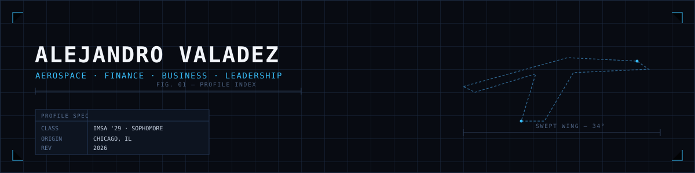

  

  <a href="https://alejandrovaladez.me">Portfolio</a> ·
  <a href="https://link-in-bio-beta-ten.vercel.app">Links</a> ·
  <a href="https://www.linkedin.com/in/alejandro-valadez">LinkedIn</a> ·
  <a href="mailto:alejandrovaladezmail@gmail.com">Email</a>

### 01 — Who I Am

I'm a sophomore at the **Illinois Mathematics and Science Academy** focused on aerospace engineering, finance, and business. I want to challenge myself, keep learning, and understand the world at a deeper level. Most of what I build starts the same way: something is slow or annoying, so I write a tool that isn't. Most recently, that was an MCP server that lets Claude read my Canvas coursework instead of me digging through it myself.

- **Aerospace** — on scholarship, a month with CIEE in Toulouse, France, in partnership with Airbus. I led my team's model rocket build at INSA Toulouse, designed in OpenRocket.
- **Finance & business** — trading and investing since I was 10, and running a shaved ice and caramel apple stand since 2023, now run by my younger brother.
- **Leadership** — elected Vice President of the Class of 2029 at Jones College Prep, 8th grade class president, and a tutor in IMSA's PROMISE program.
- **Software** — MCP servers, games, and small Python and TypeScript tools: whatever removes the friction in front of me.

### 02 — Research & Recognition

- **Runaway Ramps: Slowing Down With Science** — a physics study modeled on highway runaway truck ramps. Built a ramp-and-RC-car rig and measured stopping distance across concrete, sand, gravel, and glass; gravel stopped the car in 0.41m, glass took 1.21m — roughly three times farther. `IJAS State Exposition — Silver Award`
- **Avenues to Kindness** — partnered with a disability-independence organization to design and deliver 90 handmade cards to residents. `Tim Heneghan S.O.A.R. Award · IB Principled Learner Award`

### 03 — Projects

| Project | What it is | |
|---|---|---|
| **[canvas-mcp](https://github.com/Alejandro-Valadez/canvas-mcp)** | An MCP server that connects Claude to Canvas LMS — coursework, rubrics, submissions, and feedback, in plain conversation. | `source` |
| **[le-grand-tour](https://github.com/Alejandro-Valadez/le-grand-tour)** | A multiplayer French-review board game for 2–6 players on their phones, built solo as a [website](https://le-grand-tour.vercel.app) and then as a published Roblox game in Luau. | `live` |
| **[portfolio-site](https://github.com/Alejandro-Valadez/portfolio-site)** | My portfolio at [alejandrovaladez.me](https://alejandrovaladez.me): Next.js, deployed on Vercel. | `live` |
| **[link-in-bio](https://link-in-bio-beta-ten.vercel.app)** | Link-in-bio landing page for everything else. | `live` |
| **[mathutils](https://github.com/Alejandro-Valadez/mathutils)** | A Python utility library. | `source` |

### 04 — Where I Work & Learn

**Illinois Mathematics and Science Academy** — Sophomore · IMSA PROMISE Program Tutor, 9th grade · AEROspace Club · IMSA Society of Engineers · TALENT (entrepreneurship) · Financial Empowerment Class · Speech Team

**Jones College Prep** — Freshman year · Elected Vice President, Class of 2029 · Underclassmen Spring Dance raised $3,000 · 4.0 unweighted / 4.8 weighted GPA

**CIEE Toulouse — Airbus Partnership** — Aerospace engineering program on scholarship, Summer 2026 · Rocket team lead

**IMSA PROMISE Program** — Student, 2023–2026 → Tutor, 2026–present

### 05 — Stack

### 06 — Competitions & Awards

- **2026** — Northwestern Policy Debate City Championship, Quarterfinalist
- **2025** — City of Chicago Math League, Algebra 1 Contest, Selected Team Starter
- **2025** — Student Video Team Math Contest, 1st Place
- **2025** — State Seal of Biliteracy, Spanish
- **2025** — SEAMS Diligent Scholar Award
- **2025** — IJAS 98th Annual State Exposition, Silver Award

---

  📧 <a href="mailto:alejandrovaladezmail@gmail.com">Email</a> ·
  💼 <a href="https://www.linkedin.com/in/alejandro-valadez">LinkedIn</a> ·
  🌐 <a href="https://alejandrovaladez.me">Portfolio</a>

Chicago, IL

